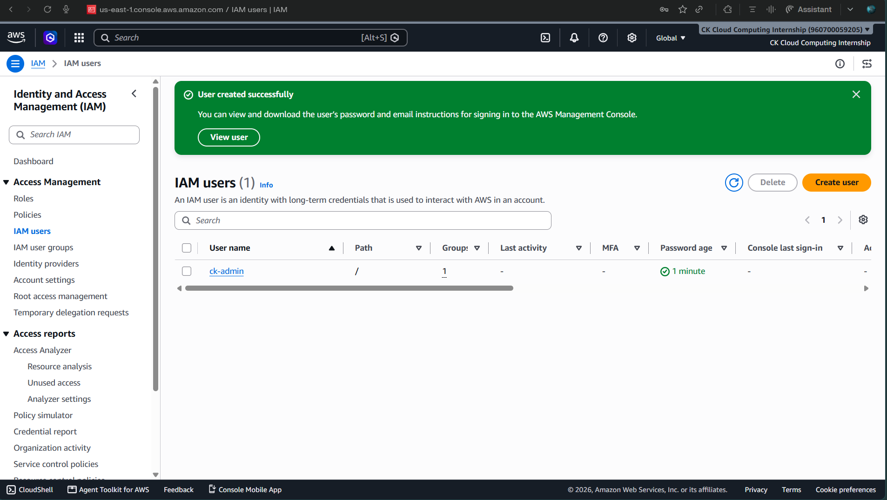
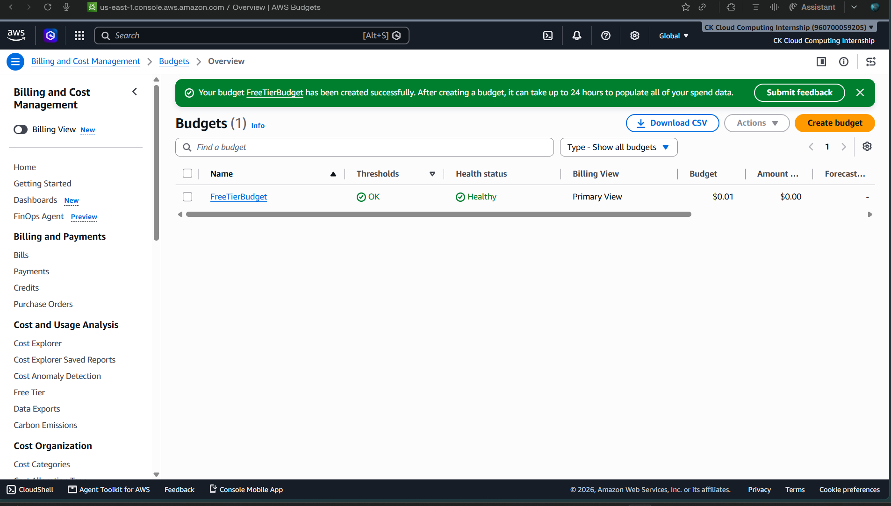

# ☁️ AWS Cloud Projects


> **A hands-on journey through core AWS services—from static hosting to containerized deployments.**

---

## 📈 Learning Journey

```text
                 AWS Cloud Journey

   🌐 S3
      │
      ▼
 🖥️ EC2 + Apache
      │
      ▼
 ⚡ Lambda + API Gateway
      │
      ▼
 🐳 Docker on EC2
```

---

## 🗺️ Project Roadmap

| Project              | Architecture                           | Details                               |
| -------------------- | -------------------------------------- | ------------------------------------- |
| **① Static Website** | `👤 → 🌐 S3 → Website`                 | [View →](./Task-1-Static-Website-S3)  |
| **② Cloud VM**       | `👤 → EC2 → Ubuntu → Apache`           | [View →](./Task-2-EC2-Apache)         |
| **③ Serverless API** | `Client → API Gateway → Lambda → JSON` | [View →](./Task-3-Lambda-API-Gateway) |
| **④ Containers**     | `👤 → EC2 → Docker → Nginx`            | [View →](./Task-4-Docker-on-EC2)      |

---

## 🏗️ Architectures

### 🌐 Project 1

```text
Browser
   │
   ▼
Amazon S3
   │
   ▼
Static Website
```

---

### 🖥️ Project 2

```text
Browser
   │
   ▼
Amazon EC2
   │
   ▼
Ubuntu
   │
   ▼
Apache
```

---

### ⚡ Project 3

```text
Client
   │
   ▼
API Gateway
   │
   ▼
Lambda
   │
   ▼
JSON Response
```

---

### 🐳 Project 4

```text
Browser
   │
   ▼
Amazon EC2
   │
   ▼
Docker
   │
   ▼
Nginx
```

---

## 🧰 Stack

```text
AWS
├── S3
├── EC2
├── IAM
├── Lambda
└── API Gateway

Linux
├── Ubuntu
├── Apache
├── Docker
└── Nginx
```

---

## 📷 AWS Console Screenshots

### IAM User Overview


### AWS Free Tier Billing


---

<div align="center">

**Learn → Build → Deploy → Scale 🚀**

</div>
