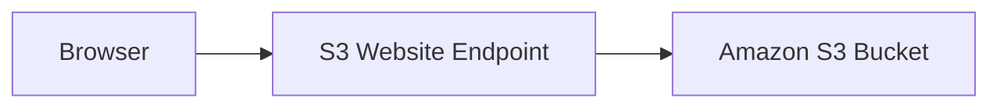
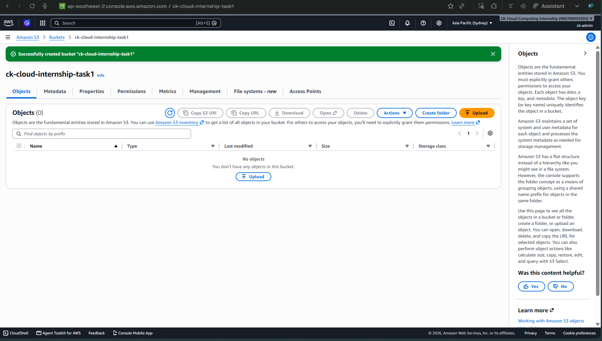
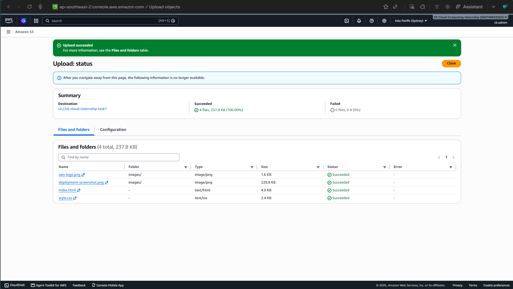
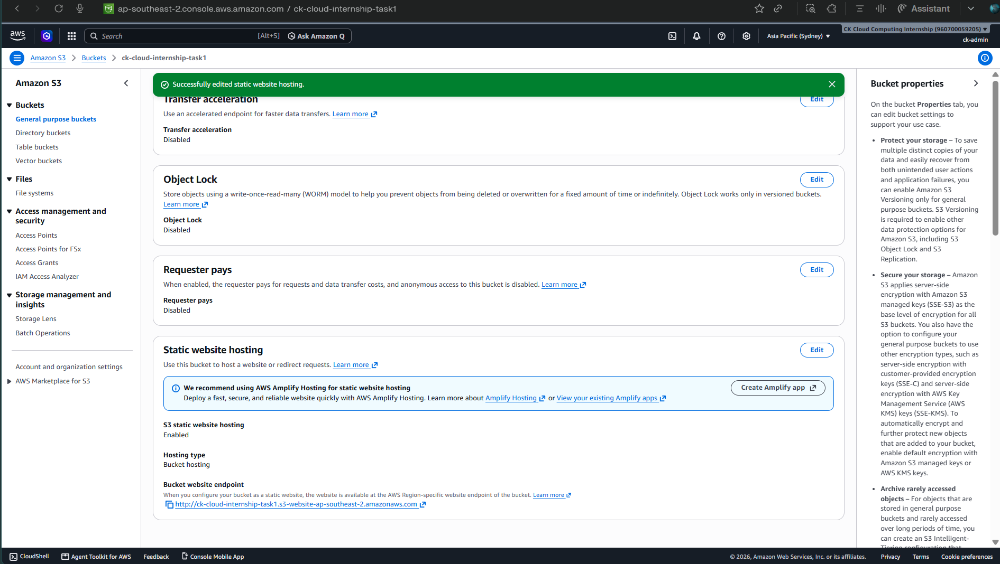
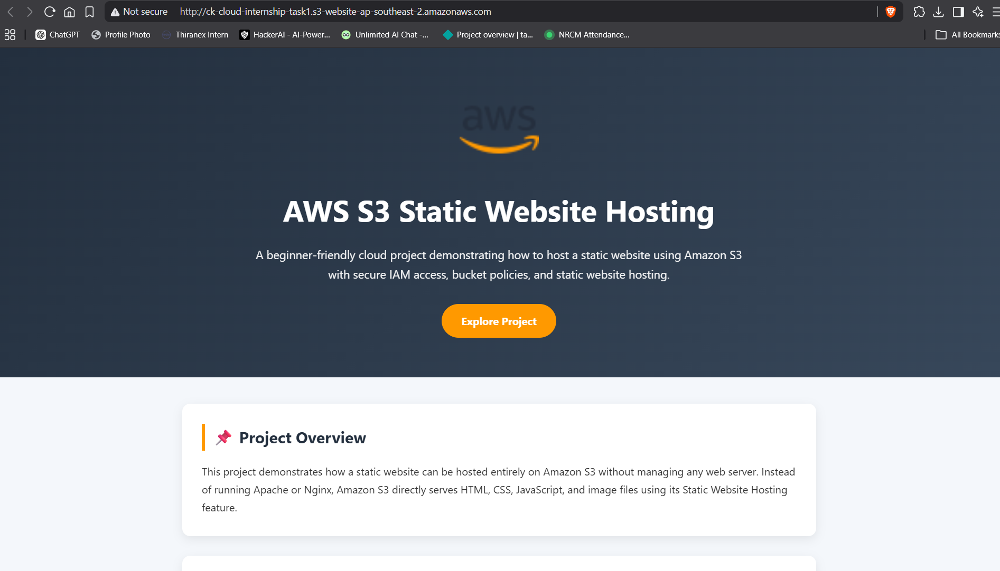
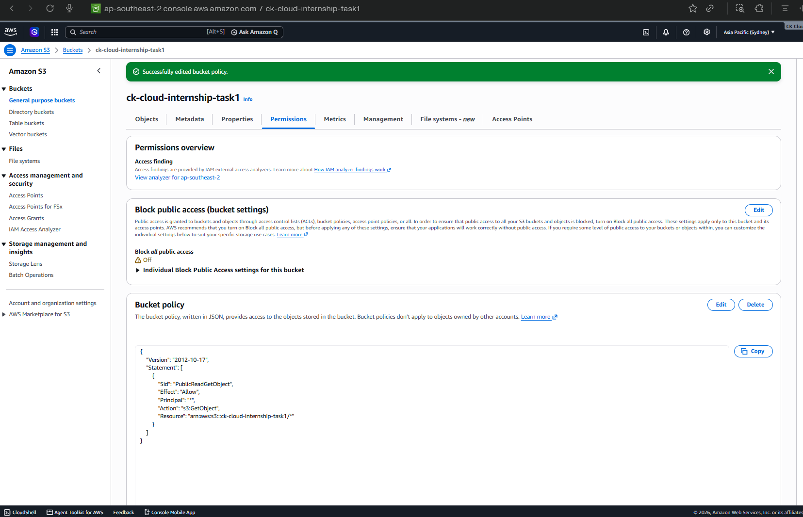

# 🌐 AWS S3 Static Website Hosting

<p align="center">


</p>

> A beginner-friendly AWS project demonstrating how to host a static website using **Amazon S3** without managing a web server.

---

# 🚀 Project Flow

```text
Browser
    │
    ▼
S3 Website Endpoint
    │
    ▼
Amazon S3 Bucket
    │
    ▼
Static Website
```

---

# ✨ Highlights

✅ Static website hosted on Amazon S3

✅ Public access configured using Bucket Policy

✅ Built using AWS Free Tier

✅ No web server required

---

# ☁️ AWS Services

| Service | Purpose |
|:--------:|---------|
| Amazon S3 | Static website hosting |
| IAM | Secure AWS access |
| AWS Budgets | Free Tier monitoring |

---

# 📂 Project Workflow

| Step | Description |
|------|-------------|
| 1️⃣ | Created an Amazon S3 bucket |
| 2️⃣ | Uploaded website files |
| 3️⃣ | Enabled Static Website Hosting |
| 4️⃣ | Configured Bucket Policy |
| 5️⃣ | Tested the live website |

---

# 🏗️ Architecture



---

# 📸 Project Gallery

| Bucket | Upload |
|:-------:|:------:|
|  |  |

| Hosting | Live Website |
|:--------:|:------------:|
|  |  |

<details>

<summary><b>View Bucket Policy Screenshot</b></summary>



</details>

---

# 💡 Key Learnings

- Amazon S3 Static Website Hosting
- Bucket Policies
- Public Access Configuration
- Object Storage
- Website Endpoints
- AWS Free Tier Best Practices

---

<div align="center">

### ⭐ First hands-on AWS project built while learning cloud fundamentals.

**Learn → Build → Deploy 🚀**

</div>