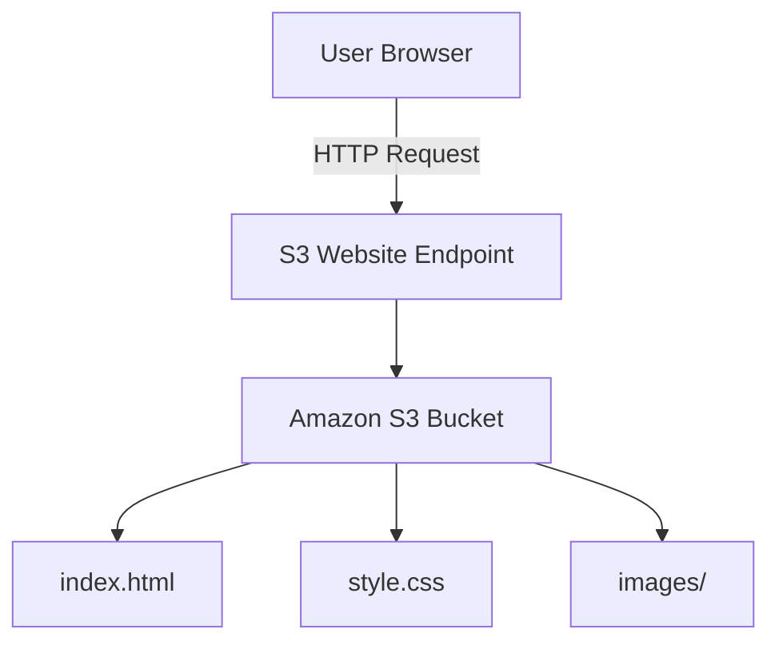

# AWS S3 Static Website Hosting

> A hands-on AWS project demonstrating how to host a static website using **Amazon S3**, configure public access securely, and publish it through the **S3 Static Website Endpoint**.

<p align="center">
  
</p>

<p align="center">
  
  
  
</p>

---

## 📖 Overview

This project demonstrates how to deploy a **static website** on **Amazon S3** without managing any web server.

Instead of using Apache or Nginx, Amazon S3 directly serves static assets such as HTML, CSS, and images through its built-in **Static Website Hosting** feature. This approach is simple, highly available, scalable, and ideal for lightweight websites.

---

## 🎯 Objectives

- Create an Amazon S3 bucket
- Upload static website files
- Enable Static Website Hosting
- Configure public read access using a Bucket Policy
- Publish the website through the S3 Website Endpoint

---

## 🛠️ AWS Services Used

| AWS Service | Purpose |
|-------------|---------|
| Amazon S3 | Object storage & static website hosting |
| IAM | Secure administrative access |
| AWS Budgets | Monitor Free Tier usage |

---

## 🏗️ Architecture



---

## 🚀 Implementation

### Step 1 — Create an S3 Bucket

- Created an S3 bucket
- Selected **Asia Pacific (Sydney)** region
- Disabled **Block Public Access** (required for static website hosting)

---

### Step 2 — Upload Website Files

Uploaded the following project files:

```text
index.html
style.css
images/
├── aws-logo.png
└── deployment-screenshot.png
```

---

### Step 3 — Enable Static Website Hosting

Configured:

- Static Website Hosting → **Enabled**
- Index Document → `index.html`

AWS automatically generated a website endpoint.

---

### Step 4 — Configure Bucket Policy

Configured a Bucket Policy to allow public read access (`s3:GetObject`) so visitors can access the website.

---

### Step 5 — Test the Website

Verified the deployment by opening the generated S3 Website Endpoint in a browser.

---

## 🌐 Live Demo

**Website Endpoint**

```text
http://ck-cloud-internship-task1.s3-website-ap-southeast-2.amazonaws.com
```

---

## 📂 Project Structure

```text
Task1-S3-Static-Website/
│
├── index.html
├── style.css
├── images/
│   ├── aws-logo.png
│   └── deployment-screenshot.png
└── README.md
```

---

## 📸 Screenshots

### S3 Bucket Created


### Website Files Uploaded


### Static Website Hosting Enabled


### Bucket Policy


### Live Website


---

## 🧠 AWS Concepts Learned

- Amazon S3 Buckets
- Object Storage
- Static Website Hosting
- Bucket Policies
- Public Access Configuration
- Uploading Objects to S3
- Website Endpoints
- IAM Best Practices
- Serverless Static Website Hosting

---

## ⚡ Challenges

- Understanding when to disable **Block Public Access** for a public website.
- Configuring the correct Bucket Policy to avoid access errors.
- Organizing website assets with the correct folder structure.

---

## 🎓 Key Takeaways

By completing this project, I learned how to:

- Deploy a static website without a web server.
- Configure Amazon S3 for public hosting.
- Manage access securely using Bucket Policies.
- Understand how static assets are served from object storage.
- Build and deploy a cloud project while staying within the AWS Free Tier.

---

## ✅ Conclusion

This project provided practical experience with one of the most fundamental AWS services—**Amazon S3**. It covers the complete workflow of creating a storage bucket, hosting a static website, configuring public access, and publishing it online, forming a strong foundation for more advanced cloud projects.

---

### ⭐ If you found this project useful, consider giving this repository a star!