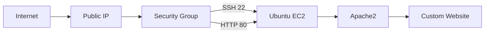
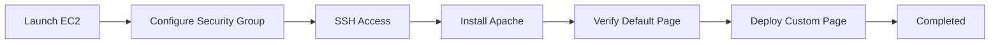

# ☁️ Deploy a Web Server on AWS EC2

> Provisioning an Ubuntu virtual machine, configuring secure access, and deploying a web server with Apache.

<p align="center">


</p>

---

## 📖 Overview

Unlike static website hosting on S3, this project explores the **compute** side of AWS by deploying a Linux virtual machine, configuring networking, installing Apache, and serving a custom webpage over the internet.

---

## 🏗️ Architecture



---

## 🚀 Deployment Journey



---

## ⚙️ AWS Configuration

| Component  | Value                         |
| ---------- | ----------------------------- |
| Service    | Amazon EC2                    |
| OS         | Ubuntu 24.04 LTS              |
| Instance   | t3.micro (Free Tier Eligible) |
| Web Server | Apache2                       |
| Storage    | 8 GiB gp3                     |
| SSH        | Port 22                       |
| HTTP       | Port 80                       |

---

## 🧩 What Happened

```text
☁️ Launched an Ubuntu EC2 instance
        │
        ▼
🔒 Configured Security Group
        │
        ▼
💻 Connected via SSH
        │
        ▼
📦 Installed Apache2
        │
        ▼
🌐 Verified Apache Default Page
        │
        ▼
✨ Replaced it with
   "Hello from Cloud VM"
```

---

## 💻 Commands Used

```bash
sudo apt update
sudo apt upgrade -y
sudo apt install apache2 -y
sudo systemctl start apache2
sudo systemctl enable apache2
sudo systemctl status apache2
echo "<h1>Hello from Cloud VM</h1>" | sudo tee /var/www/html/index.html
```

---

## 📸 Screenshots

```
images/
├── ec2-dashboard.png
├── security-group.png
├── ssh-terminal.png
├── apache-status.png
├── apache-default-page.png
└── hello-from-cloud-vm.png
```

---

## 🛠 Services Used

| AWS Service    | Purpose               |
| -------------- | --------------------- |
| EC2            | Virtual Machine       |
| Security Group | Firewall              |
| EBS            | Root Storage          |
| VPC            | Networking            |
| SSH            | Remote Administration |
| Apache2        | Web Server            |

---

## 💡 Challenges

| Challenge                                          | Solution                                                        |
| -------------------------------------------------- | --------------------------------------------------------------- |
| Free Tier offered `t3.micro` instead of `t2.micro` | Used the current Free Tier eligible instance                    |
| Needed to verify networking                        | Confirmed the default Apache page before customization          |
| Wanted to save Free Tier hours                     | Collected screenshots and stopped the instance after completion |

---

## 📚 Key Learnings

* Provisioning cloud virtual machines
* Connecting securely with SSH
* Configuring Security Groups
* Installing and managing Apache
* Serving a website from Linux
* Verifying deployments before customization
* Managing AWS resources responsibly

---

## ✅ Final Outcome

* ✔ Ubuntu EC2 instance deployed
* ✔ Apache2 installed and running
* ✔ HTTP access configured
* ✔ Custom **Hello from Cloud VM** webpage deployed
* ✔ Successfully completed within AWS Free Tier

---

## 📷 Final Result

```text
Internet
   │
Public IP
   │
Ubuntu EC2
   │
Apache2
   │
Hello from Cloud VM 🚀
```

---

<div align="center">

**Built with ❤️ using AWS EC2, Ubuntu & Apache**

⭐ *If you found this project interesting, consider giving it a star.*

</div>
