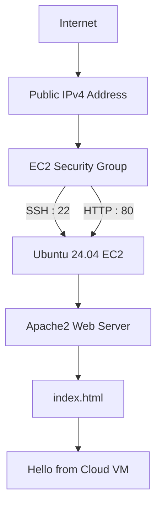

# ☁️ Deploying a Web Server on AWS EC2 with Apache

> Launching a Linux server in the cloud, configuring secure access, and serving a custom webpage from scratch using Amazon EC2 and Apache.

---

## 📖 Overview

After hosting a static website on Amazon S3, I wanted to understand what happens when **you are responsible for the server itself**.

This project explores the compute side of AWS by provisioning an Ubuntu virtual machine, configuring network access, installing Apache, and deploying a simple webpage. Rather than relying on managed hosting, this time I built and managed the web server myself.

---

## 🎯 Objective

Create a publicly accessible web server on AWS that:

- Launches an Ubuntu EC2 instance
- Allows secure remote administration via SSH
- Serves HTTP traffic over the internet
- Hosts a custom **"Hello from Cloud VM"** webpage
- Stays within the AWS Free Tier

---

## 🏗️ Architecture



---

## ⚙️ Project Journey

### 🚀 Launching the Server

The project began by provisioning an Ubuntu 24.04 EC2 instance.

Although the original task referenced **t2.micro**, my AWS account currently provides **t3.micro** as the Free Tier eligible instance, so I used the newer generation while keeping everything within the Free Tier.

A new SSH key pair was generated during launch to securely access the server.

---

### 🔐 Securing the Instance

Before installing anything, I configured the instance's Security Group with only the ports required for the project.

| Port | Purpose |
|------:|---------|
| **22** | Remote administration via SSH |
| **80** | Public HTTP access |

This ensured the server could be managed remotely while remaining accessible as a web server.

---

### 💻 Connecting to the Cloud

Using Windows Terminal and the downloaded `.pem` key, I connected to the Ubuntu instance over SSH.

Seeing

```bash
ubuntu@ip-xxx-xx-xx-xx:~$
```

confirmed that I was now working directly inside a Linux machine running in AWS.

---

### 📦 Preparing the Server

Before installing Apache, I updated the package index and upgraded existing packages to ensure the system was up to date.

```bash
sudo apt update
sudo apt upgrade -y
```

---

### 🌐 Installing Apache

Next came the actual web server.

```bash
sudo apt install apache2 -y
```

Once installed, Apache was started and configured to automatically start whenever the instance boots.

```bash
sudo systemctl start apache2
sudo systemctl enable apache2
```

A quick status check confirmed everything was running successfully.

```bash
sudo systemctl status apache2
```

---

### 🎉 The First Success

Before changing anything, I visited the instance's Public IPv4 address.

Instead of an error page, the browser displayed the familiar **Apache2 Ubuntu Default Page**.

That small moment confirmed that:

- the EC2 instance was reachable,
- Apache was installed correctly,
- networking was configured properly,
- and HTTP traffic was flowing exactly as expected.

---

### ✨ Deploying the Custom Page

With the infrastructure verified, I replaced Apache's default homepage with a simple custom page.

```bash
echo "<h1>Hello from Cloud VM</h1>" | sudo tee /var/www/html/index.html
```

Refreshing the browser immediately displayed the new page, confirming that the deployment was complete.

---

### 💰 Thinking Beyond the Task

After documenting the project, I chose to **stop the EC2 instance** instead of leaving it running indefinitely.

For a portfolio project, high-quality documentation and screenshots provide long-term value while avoiding unnecessary Free Tier usage.

---

## 📸 Screenshots

> Replace these placeholders with your own screenshots.

```
images/ec2-dashboard.png
images/security-group.png
images/ssh-terminal.png
images/apache-status.png
images/apache-default-page.png
images/hello-from-cloud-vm.png
```

---

## 🛠 AWS Services Used

| Service | Purpose |
|---------|---------|
| **Amazon EC2** | Virtual machine hosting |
| **Ubuntu 24.04 LTS** | Operating system |
| **Security Groups** | Network firewall |
| **Apache2** | Web server |
| **SSH** | Secure remote access |
| **Amazon VPC** | Default networking |
| **Amazon EBS** | Root storage volume |

---

## 💡 Challenges & Solutions

| Challenge | Solution |
|-----------|----------|
| Task instructions referenced `t2.micro`, while AWS offered `t3.micro` as the Free Tier option. | Used the current Free Tier eligible instance without changing the overall deployment process. |
| Needed to verify whether Apache or networking was causing issues. | Opened the Public IP before customization and confirmed the default Apache page loaded successfully. |
| Wanted to preserve Free Tier usage after completing the project. | Documented the deployment thoroughly and stopped the instance after collecting screenshots. |

---

## 📚 Key Learnings

- The difference between **object storage (S3)** and **compute (EC2)**.
- How Security Groups act as a virtual firewall.
- Connecting securely to Linux servers using SSH.
- Installing and managing services with `apt` and `systemctl`.
- How Apache serves content from `/var/www/html`.
- The importance of verifying infrastructure before making application changes.
- Why balancing live demos with cloud cost management matters when building a portfolio.

---

## 🚀 Final Outcome

By the end of this project, I had successfully:

- ✅ Provisioned an Ubuntu EC2 instance
- ✅ Configured secure network access
- ✅ Connected remotely using SSH
- ✅ Installed and configured Apache2
- ✅ Verified the default Apache deployment
- ✅ Published a custom webpage
- ✅ Documented the project while staying within the AWS Free Tier

This project strengthened my understanding of how cloud servers are provisioned, secured, and transformed into publicly accessible web applications—one of the core building blocks of cloud infrastructure.

---

<div align="center">

**Built with AWS EC2 • Ubuntu • Apache2**

⭐ If you found this project interesting, feel free to explore the repository.

</div>