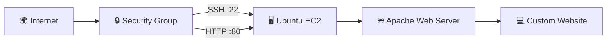
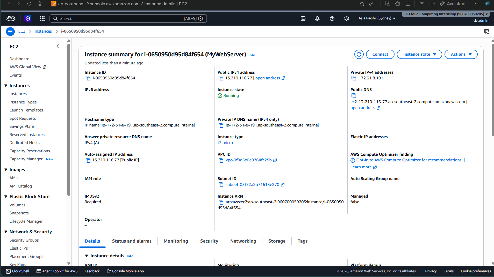
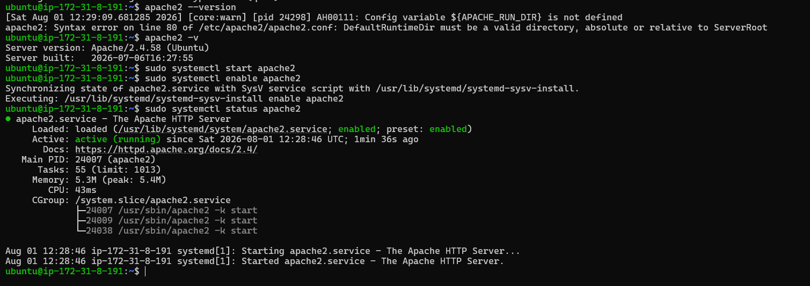
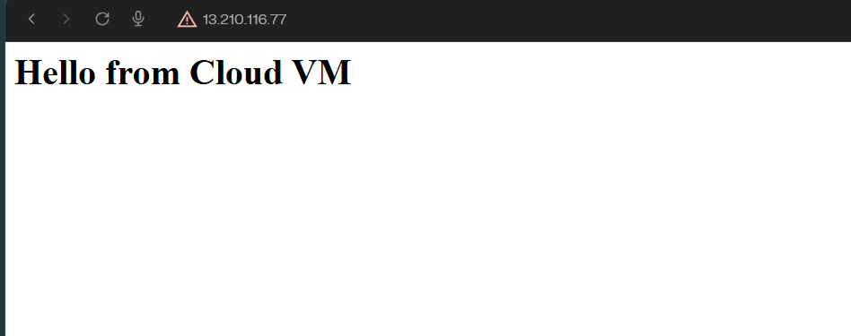

# 🖥️ Deploy a Web Server on AWS EC2

<p align="center">


</p>

> A hands-on AWS project demonstrating how to launch an Ubuntu EC2 instance, configure secure access, and deploy a web server using Apache.

---

# 🚀 Project Flow

```text
Launch EC2
     │
     ▼
Configure Security Group
     │
     ▼
Connect via SSH
     │
     ▼
Install Apache
     │
     ▼
Deploy Website
```

---

# ✨ Highlights

- ✅ Ubuntu EC2 instance deployed
- ✅ Apache Web Server installed
- ✅ SSH & HTTP access configured
- ✅ Custom webpage hosted successfully
- ✅ Completed using AWS Free Tier

---

# ☁️ AWS Services

| Service | Purpose |
|:--------:|---------|
| Amazon EC2 | Virtual Machine |
| Security Group | Network Firewall |
| EBS | Root Storage |
| VPC | Networking |
| Apache2 | Web Server |

---

# 🏗️ Architecture



---

# 📂 Deployment Workflow

| Step | Description |
|------|-------------|
| **1️⃣** | Launch an Ubuntu EC2 instance |
| **2️⃣** | Configure Security Group (SSH & HTTP) |
| **3️⃣** | Connect using SSH |
| **4️⃣** | Install and start Apache |
| **5️⃣** | Replace the default page with a custom webpage |

---

# 💻 Commands Used

```bash
sudo apt update
sudo apt install apache2 -y
sudo systemctl enable apache2
sudo systemctl start apache2
echo "<h1>Hello from Cloud VM</h1>" | sudo tee /var/www/html/index.html
```

<details>
<summary><b>View Complete Command History</b></summary>

```bash
sudo apt update
sudo apt upgrade -y
sudo apt install apache2 -y
sudo systemctl start apache2
sudo systemctl enable apache2
sudo systemctl status apache2
echo "<h1>Hello from Cloud VM</h1>" | sudo tee /var/www/html/index.html
```

</details>

---

# 📸 Project Gallery

| EC2 Dashboard | Apache Running |
|:-------------:|:--------------:|
|  |  |

| Live Website |
|:------------:|
|  |

---

# 📚 Key Learnings

- Provisioning virtual machines on AWS
- Connecting securely using SSH
- Configuring Security Groups
- Installing and managing Apache
- Hosting a website on Linux
- Understanding the fundamentals of AWS networking

---

<div align="center">

### ⭐ My first compute-based AWS project using Amazon EC2.

**Launch → Secure → Deploy 🚀**

</div>