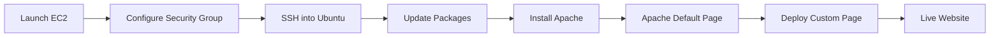

# ☁️ Deploying a Web Server on AWS EC2

> From launching a cloud server to serving a custom webpage with Apache.

<p align="center">


</p>

---

## ✨ Overview

After deploying a **static website on Amazon S3**, I wanted to explore what happens when **I'm responsible for the server itself**.

This project provisions an **Ubuntu EC2 instance**, secures it with **Security Groups**, installs **Apache**, and deploys a simple webpage that is accessible over the internet.

---

# 🏗 Architecture

```mermaid
flowchart TD

A[🌍 Internet]
    -->B[🌐 Public IPv4]

B --> C[🛡 Security Group]

C -->|22 SSH| D[☁️ EC2 Ubuntu]

C -->|80 HTTP| D

D --> E[🅰 Apache Web Server]

E --> F[/var/www/html/index.html]

F --> G["Hello from Cloud VM 🚀"]
```

---

# 🚀 Deployment Journey



---

## ⚡ Project Flow

```text
🖥 Launch Ubuntu EC2
          │
          ▼
🔐 Configure Security Group
          │
          ▼
💻 Connect using SSH
          │
          ▼
📦 Install Apache2
          │
          ▼
🌐 Verify Default Apache Page
          │
          ▼
✨ Replace with Custom Page
          │
          ▼
🚀 Hello from Cloud VM
```

---

# 🛠 AWS Configuration

| Component | Configuration |
|-----------|---------------|
| Compute | Amazon EC2 |
| Operating System | Ubuntu 24.04 LTS |
| Instance Type | t3.micro (Free Tier Eligible) |
| Web Server | Apache2 |
| Storage | 8 GiB gp3 |
| Firewall | Security Group |
| SSH | Port 22 |
| HTTP | Port 80 |

---

# 📖 Journey

### ☁️ Provisioning Compute

A new Ubuntu virtual machine was launched on Amazon EC2.

> 💡 Although the original task mentioned **t2.micro**, my AWS account currently provides **t3.micro** as the Free Tier eligible instance, so that was used instead.

---

### 🔒 Networking

A Security Group was configured with only the required inbound rules.

| Port | Purpose | Status |
|------|----------|--------|
| 22 | SSH | ✅ |
| 80 | HTTP | ✅ |

---

### 💻 Remote Access

Connected securely using SSH from **Windows Terminal**.

```bash
ssh -i mywebserver-key.pem ubuntu@<Public-IP>
```

Successfully reaching

```bash
ubuntu@ip-xxx-xx-xx-xx:~$
```

confirmed remote access was working.

---

### 📦 Server Setup

Prepared Ubuntu and installed Apache.

```bash
sudo apt update
sudo apt upgrade -y
sudo apt install apache2 -y
```

Started Apache and enabled it during boot.

```bash
sudo systemctl start apache2
sudo systemctl enable apache2
```

Verified the service.

```bash
sudo systemctl status apache2
```

```
● apache2.service
Active: active (running) ✅
```

---

### 🌐 First Verification

Before deploying my own page, I opened the server's Public IPv4 address.

Instead of an error, the **Apache Default Page** appeared.

That immediately confirmed:

- ✅ EC2 was reachable
- ✅ Apache was running
- ✅ HTTP traffic worked
- ✅ Security Group was configured correctly

---

### ✨ Deploying the Website

The default Apache homepage was replaced with a custom page.

```bash
echo "<h1>Hello from Cloud VM</h1>" | sudo tee /var/www/html/index.html
```

Refreshing the browser displayed:

# Hello from Cloud VM 🚀

Mission accomplished.

---

# 📸 Screenshots

| Stage | Preview |
|--------|---------|
| EC2 Running | `images/ec2-dashboard.png` |
| Security Group | `images/security-group.png` |
| SSH Session | `images/ssh-terminal.png` |
| Apache Status | `images/apache-status.png` |
| Default Apache Page | `images/apache-default-page.png` |
| Final Website | `images/hello-from-cloud-vm.png` |

---

# 📊 Deployment Summary

| Step | Status |
|-------|--------|
| EC2 Provisioned | ✅ |
| SSH Connected | ✅ |
| Security Group Configured | ✅ |
| Apache Installed | ✅ |
| Apache Running | ✅ |
| Default Page Verified | ✅ |
| Custom Page Deployed | ✅ |
| Public Website Accessible | ✅ |

---

# 💡 Challenges

| Challenge | Solution |
|-----------|----------|
| Free Tier no longer offered `t2.micro` | Used the current Free Tier eligible `t3.micro` |
| Wanted to verify infrastructure before deployment | Confirmed the Apache default page first |
| Portfolio vs AWS cost | Captured screenshots, documented everything, then stopped the instance to preserve Free Tier usage |

---

# 📚 What I Learned

```text
✓ Provisioning cloud virtual machines

✓ Understanding Security Groups

✓ Connecting via SSH

✓ Installing software on Linux

✓ Managing services using systemctl

✓ Hosting websites with Apache

✓ Verifying deployments before customization

✓ Balancing cloud resources with Free Tier limits
```

---

# 🚀 Final Outcome

```text
Internet
    │
    ▼
Public IP
    │
    ▼
Ubuntu EC2
    │
    ▼
Apache2
    │
    ▼
Hello from Cloud VM 🎉
```

The project successfully transformed a freshly launched Ubuntu EC2 instance into a publicly accessible web server using Apache while remaining entirely within the AWS Free Tier.

---

## ⭐ Repository Highlights

- ✅ Amazon EC2
- ✅ Ubuntu 24.04 LTS
- ✅ Apache2 Web Server
- ✅ SSH Administration
- ✅ Security Groups
- ✅ Cloud Networking
- ✅ AWS Free Tier Friendly

---

<div align="center">

### Thanks for visiting! 👋

If you enjoyed this project, consider giving it a ⭐.

</div>