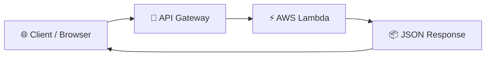
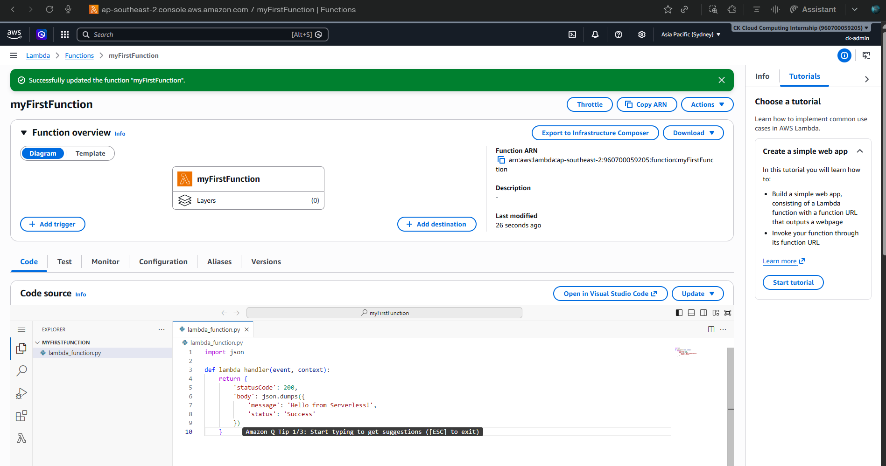
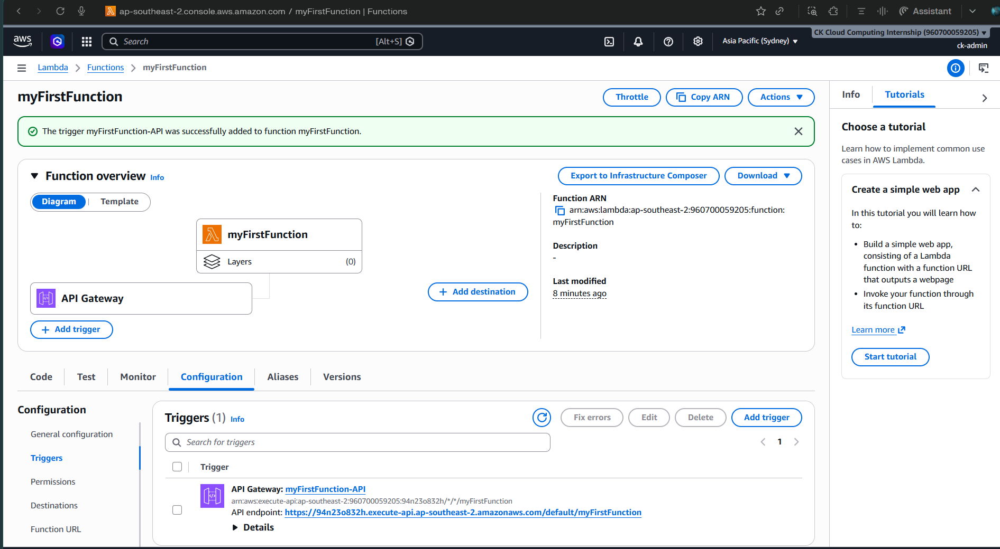
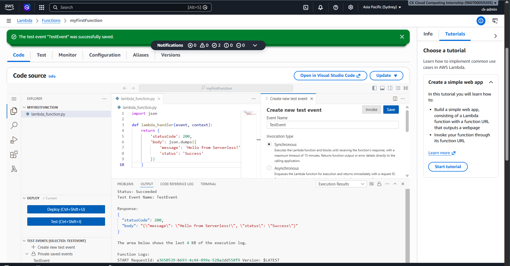
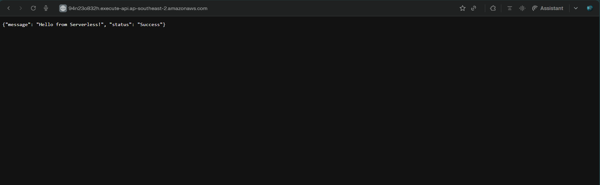

# ⚡ Task-3-Lambda-API-Gateway


A lightweight serverless API built with **AWS Lambda** and **API Gateway** that returns a JSON response through a publicly accessible endpoint.

---

## 🚀 Overview

This project demonstrates how to build and deploy a simple serverless application on AWS without managing any infrastructure.

A Python-based Lambda function processes incoming requests, while API Gateway exposes it through a secure HTTP endpoint. The result is a fully functional REST endpoint that responds with JSON in just a few milliseconds.

---

## 🎯 What I Built

- Created an AWS Lambda function using **Python**
- Deployed the function and validated it with Lambda test events
- Connected the function to an **HTTP API Gateway**
- Generated a public endpoint
- Verified the endpoint by accessing it directly from the browser

---

## 🏗 Architecture



---

## ⚙️ Project Flow

The project started by creating a Lambda function and implementing a small Python handler that returns a JSON response.

After deploying the function, it was validated using Lambda's built-in test events to ensure the expected response was returned.

Next, an **HTTP API Gateway** was configured as a trigger, allowing external requests to invoke the Lambda function through a public endpoint.

Finally, the generated API URL was opened in the browser, successfully returning the expected JSON response.

```json
{
  "message": "Hello from Serverless!",
  "status": "Success"
}
```

---

## 📸 Screenshots

### Lambda Function


### API Gateway Configuration


### Test Response


### Live Endpoint


---

## 🛠 Services Used

| Service | Purpose |
|---------|---------|
| AWS Lambda | Execute Python code without managing servers |
| Amazon API Gateway | Expose the Lambda function through a public HTTP endpoint |
| AWS IAM | Manage permissions for the Lambda execution role |
| Amazon CloudWatch | View execution logs and monitor function invocations |

---

## 📚 What I Learned

- The difference between server-based and serverless computing
- How AWS Lambda executes code only when invoked
- How API Gateway routes HTTP requests to Lambda
- How Lambda responses are structured using HTTP status codes and JSON
- How CloudWatch automatically captures execution logs for debugging

---

## ✅ Final Result

Successfully deployed a serverless API on AWS that executes a Python Lambda function through API Gateway and returns a JSON response via a publicly accessible endpoint.

This project highlights the fundamentals of event-driven architecture and demonstrates how AWS services can be combined to build scalable APIs without provisioning or maintaining servers.