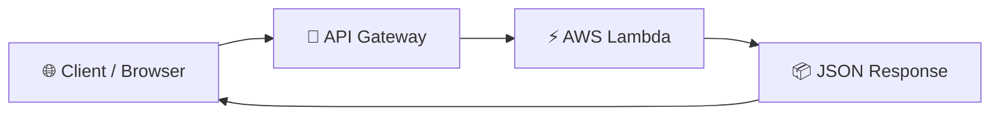

# ⚡ Build a Serverless API with AWS Lambda & API Gateway

<p align="center">


</p>

> A hands-on AWS project demonstrating how to build a serverless REST API using **AWS Lambda** and **API Gateway**, returning JSON without managing any servers.

---

# 🚀 Project Flow

```text
Create Lambda
      │
      ▼
Write Python Function
      │
      ▼
Test with Lambda Events
      │
      ▼
Connect API Gateway
      │
      ▼
Invoke Public Endpoint
```

---

# ✨ Highlights

- ✅ Python-based AWS Lambda function
- ✅ HTTP API Gateway integration
- ✅ Public REST endpoint
- ✅ JSON response returned successfully
- ✅ Built using AWS Free Tier

---

# ☁️ AWS Services

| Service | Purpose |
|:--------:|---------|
| AWS Lambda | Execute Python code on demand |
| API Gateway | Expose Lambda as a public API |
| IAM | Manage execution permissions |
| CloudWatch | Monitor logs and invocations |

---

# 🏗️ Architecture



---

# 📂 Deployment Workflow

| Step | Description |
|------|-------------|
| **1️⃣** | Create an AWS Lambda function |
| **2️⃣** | Implement the Python handler |
| **3️⃣** | Test the function using Lambda Test Events |
| **4️⃣** | Configure API Gateway as a trigger |
| **5️⃣** | Invoke the public endpoint and verify the JSON response |

---

# 💻 Lambda Response

```json
{
  "message": "Hello from Serverless!",
  "status": "Success"
}
```

---

# 📸 Project Gallery

| Lambda Function | API Gateway |
|:---------------:|:-----------:|
|  |  |

| Test Response | Live Endpoint |
|:-------------:|:-------------:|
|  |  |

---

# 📚 Key Learnings

- Understanding serverless computing
- Creating AWS Lambda functions
- Building REST APIs with API Gateway
- Returning structured JSON responses
- Using IAM roles for secure execution
- Monitoring executions with CloudWatch

---

<div align="center">

### ⭐ My first serverless application built using AWS Lambda & API Gateway.

**Code → Trigger → Respond ⚡**

</div>