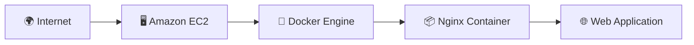
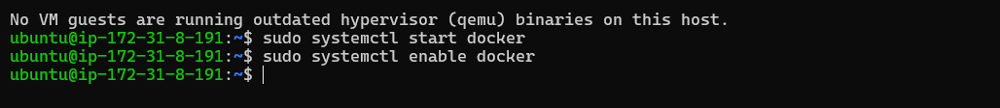
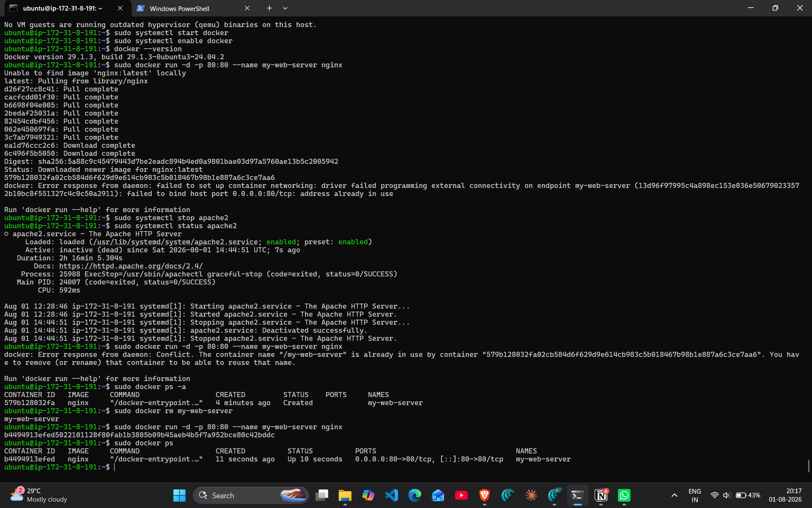
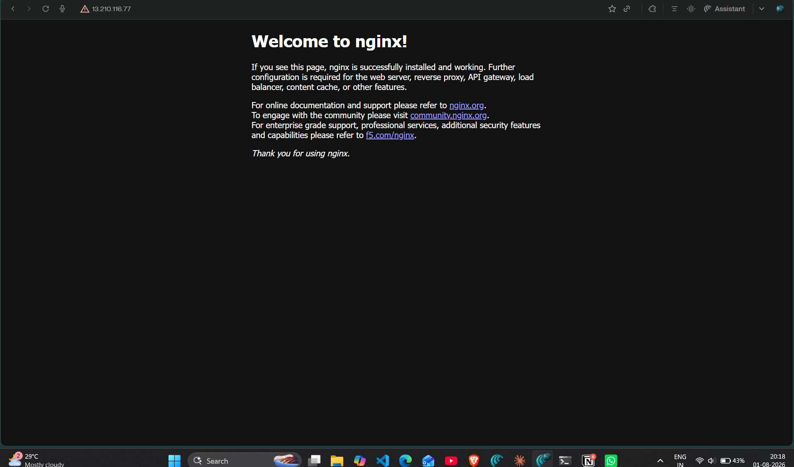

# 🐳 Deploy an Nginx Container on AWS EC2

<p align="center">


</p>

> A hands-on AWS project demonstrating how to deploy a Dockerized Nginx web server on an Amazon EC2 instance and expose it to the internet.

---

# 🚀 Project Flow

```text
Launch EC2
      │
      ▼
Install Docker
      │
      ▼
Pull Nginx Image
      │
      ▼
Run Docker Container
      │
      ▼
Access via Browser
```

---

# ✨ Highlights

- ✅ Docker installed on Ubuntu EC2
- ✅ Official Nginx container deployed
- ✅ HTTP port exposed publicly
- ✅ Application verified in browser
- ✅ Built using AWS Free Tier

---

# ☁️ Technologies Used

| Service | Purpose |
|:--------:|---------|
| Amazon EC2 | Virtual Machine |
| Ubuntu | Operating System |
| Docker Engine | Container Runtime |
| Nginx | Web Server |
| SSH | Remote Administration |

---

# 🏗️ Architecture



---

# 📂 Deployment Workflow

| Step | Description |
|------|-------------|
| **1️⃣** | Launch or reuse an Ubuntu EC2 instance |
| **2️⃣** | Install Docker Engine |
| **3️⃣** | Pull the official Nginx image |
| **4️⃣** | Run the container with port **80** exposed |
| **5️⃣** | Verify deployment using the browser |

---

# 💻 Key Commands

```bash
sudo apt update -y
sudo apt install docker.io -y

sudo systemctl start docker
sudo systemctl enable docker

sudo systemctl stop apache2

sudo docker run -d -p 80:80 --name my-web-server nginx

sudo docker ps
```

<details>

<summary><b>View Complete Command History</b></summary>

```bash
sudo apt update -y

sudo apt install docker.io -y

sudo systemctl start docker
sudo systemctl enable docker

docker --version

sudo systemctl stop apache2

sudo docker run -d -p 80:80 --name my-web-server nginx

sudo docker ps
```

</details>

---

# 📸 Project Gallery

| Docker Installation | Docker Container |
|:-------------------:|:----------------:|
|  |  |

| Live Application |
|:----------------:|
|  |

---

# 📚 Key Learnings

- Understanding containerized deployments
- Installing and managing Docker on Linux
- Running containers with port mapping
- Publishing applications using Docker
- Troubleshooting port conflicts
- Hosting containerized workloads on AWS EC2

---

<div align="center">

### ⭐ My first containerized deployment on AWS using Docker.

**Containerize → Deploy → Scale 🐳**

</div>