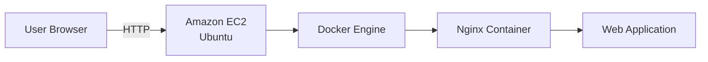

# 🐳 Dockerized Nginx on Amazon EC2

> Deploying a containerized web application on an AWS EC2 instance using Docker and exposing it to the internet.

---

## 🚀 Overview

This project demonstrates a complete Docker deployment workflow on AWS. An Ubuntu EC2 instance was configured with Docker, an official Nginx container was deployed, and the application was made publicly accessible through the instance's public IP.

The goal was to move from a traditional VM deployment to a modern containerized approach while keeping the setup simple, reproducible, and cloud-native.

---

## 🎯 Goal

* Deploy Docker on an Amazon EC2 Ubuntu instance
* Run an Nginx container
* Expose the container over HTTP
* Verify the deployment through a public browser

---

## 🏗️ Architecture



---

## ⚙️ Project Journey

Instead of installing a web server directly on the virtual machine, I deployed it as a Docker container.

The EC2 instance from a previous project was reused, updated, and prepared for container workloads. After installing Docker, I started and enabled the Docker service, pulled the official **Nginx** image, and launched it with port **80** mapped to the EC2 instance.

During deployment, Docker couldn't bind to port **80** because Apache from an earlier project was already using it. After stopping Apache, I recreated the container and successfully deployed the application.

The deployment was verified by checking the running container with `docker ps` and opening the EC2 Public IPv4 address in a browser, which displayed the default **Welcome to nginx!** page.

---

## 💻 Key Commands

```bash
sudo apt update -y

sudo apt install docker.io -y

sudo systemctl start docker
sudo systemctl enable docker

docker --version

sudo systemctl stop apache2

sudo docker run -d -p 80:80 --name my-web-server nginx

sudo docker ps
```

---

## 📸 Screenshots

### Docker Installation


### Docker Run


### Application Running


---

## 🛠️ Technologies Used

| Technology       | Purpose               |
| ---------------- | --------------------- |
| Amazon EC2       | Virtual Machine       |
| Ubuntu 24.04 LTS | Operating System      |
| Docker Engine    | Container Runtime     |
| Nginx            | Web Server            |
| SSH              | Remote Administration |

---

## 📚 Key Learnings

* Deploying applications using Docker on a cloud virtual machine.
* Managing Docker services with `systemctl`.
* Running containers with port mapping.
* Verifying container health using `docker ps`.
* Troubleshooting port conflicts caused by existing services.
* Publishing a containerized application through an EC2 Public IP.

---

## ✅ Final Outcome

Successfully deployed an **Nginx Docker container** on an **Amazon EC2 Ubuntu instance** and exposed it to the internet using port **80**. The deployment was validated through both Docker and the browser, resulting in a fully functional containerized web server running on AWS.

---

⭐ *A simple project that demonstrates the fundamentals of running containerized workloads on cloud infrastructure.*
